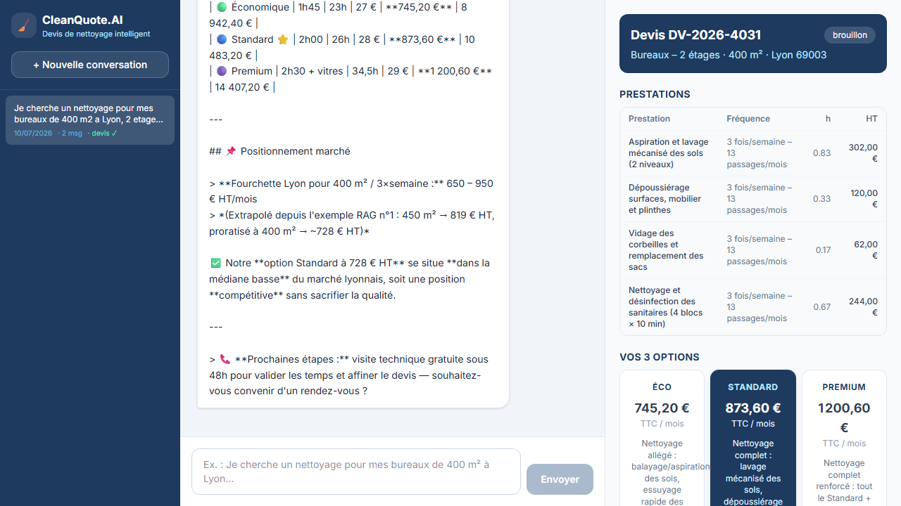
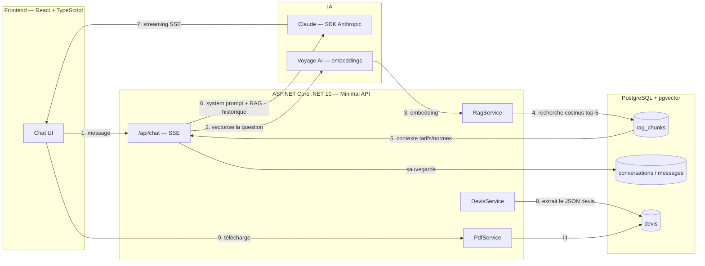

# CleanQuote.AI

Un assistant IA qui mène l'entretien commercial, chiffre le devis et le justifie — pour les entreprises de nettoyage professionnel.



## Fonctionnement

Un client décrit son besoin en langage naturel dans un chat. L'assistant pose les questions manquantes **une par une** (type de local, superficie, étages, sanitaires, fréquence, horaires, localisation, contraintes particulières) — sans jamais redemander une info déjà donnée.

À chaque échange, il consulte une base de connaissance (tarifs horaires, temps standards par type de local, majorations, normes professionnelles françaises, exemples de devis réels) pour rester ancré dans la réalité du métier plutôt que d'inventer des chiffres.

Une fois toutes les infos réunies, il génère automatiquement **3 devis chiffrés et justifiés** — Économique / Standard / Premium — avec une comparaison au prix du marché, affichés en temps réel pendant que le texte se streame. Le devis peut être téléchargé en PDF, et chaque conversation est sauvegardée pour être reprise plus tard.

## Architecture



## Stack technique

- **Backend** : ASP.NET Core .NET 10 (Minimal API), Entity Framework Core, Npgsql
- **Frontend** : React 19, TypeScript, Tailwind CSS 4, Vite
- **IA générative** : Claude (Anthropic), SDK C# officiel, streaming SSE, raisonnement étendu adaptatif
- **RAG** : Voyage AI (`voyage-code-3`) pour les embeddings, via l'abstraction `Microsoft.Extensions.AI` (`IEmbeddingGenerator`)
- **Vector store** : PostgreSQL + extension `pgvector` (recherche par similarité cosinus, index `ivfflat`)
- **PDF** : QuestPDF

## Structure du projet

```
CleanQuoteAI/
├── docker-compose.yml
├── CleanQuoteAI.Api/
│   ├── Data/            → AppDbContext, tarifs.json (données RAG)
│   ├── Models/          → Conversation, Message, Devis, RagChunk
│   ├── Services/        → ConversationService, DevisService, RagService, PdfService
│   ├── Endpoints/        → ChatEndpoints (SSE), DevisEndpoints
│   └── Program.cs
└── cleanquote-ui/
    └── src/
        ├── components/  → Chat/, Devis/, Sidebar/
        ├── hooks/        → useChat, useDevis
        └── types/
```

## Lancer le projet en local

**Prérequis** : .NET 10 SDK, Node.js, Docker Desktop, une clé [Anthropic](https://console.anthropic.com/settings/keys) et une clé [Voyage AI](https://dashboard.voyageai.com/api-keys).

```bash
# 1. Base de données (PostgreSQL + pgvector)
docker compose up -d

# 2. Secrets (backend)
cd CleanQuoteAI.Api
dotnet user-secrets set "Anthropic:ApiKey" "sk-ant-..."
dotnet user-secrets set "Voyage:ApiKey" "pa-..."

# 3. Backend — migre la base et indexe le RAG au démarrage
dotnet run

# 4. Frontend (dans un autre terminal)
cd cleanquote-ui
npm install
npm run dev
```

L'application est accessible sur `http://localhost:5173` (API sur `http://localhost:5200`).

## Endpoints API

| Route | Méthode | Description |
|---|---|---|
| `/api/chat` | `POST` | Chat streaming (SSE) — envoie un message, reçoit la réponse token par token |
| `/api/conversations` | `GET` | Liste des conversations d'une session |
| `/api/conversations/{id}/messages` | `GET` | Historique des messages d'une conversation |
| `/api/devis/{id}` | `GET` | Récupère un devis structuré |
| `/api/devis/{id}/pdf` | `GET` | Télécharge le devis en PDF |
